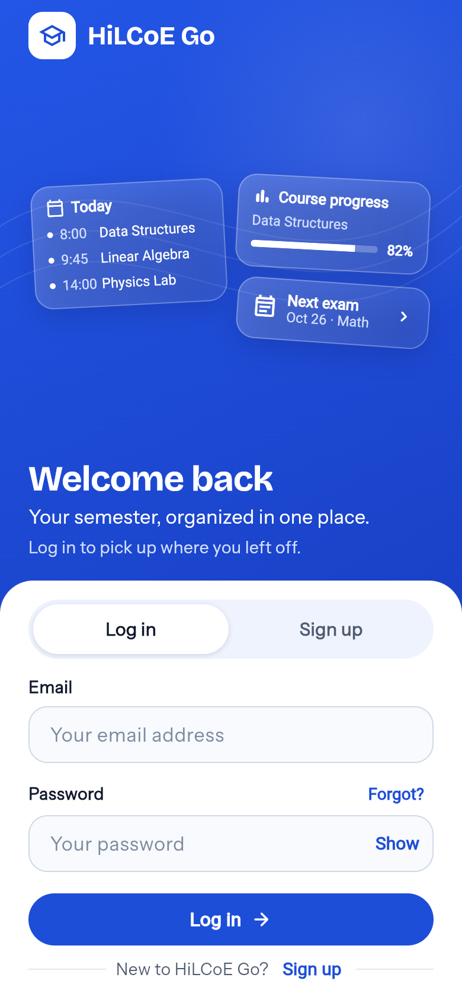
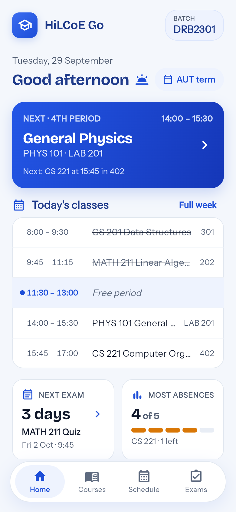
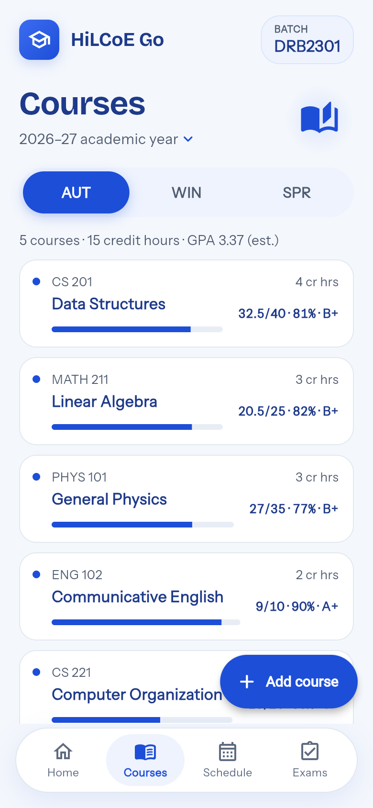
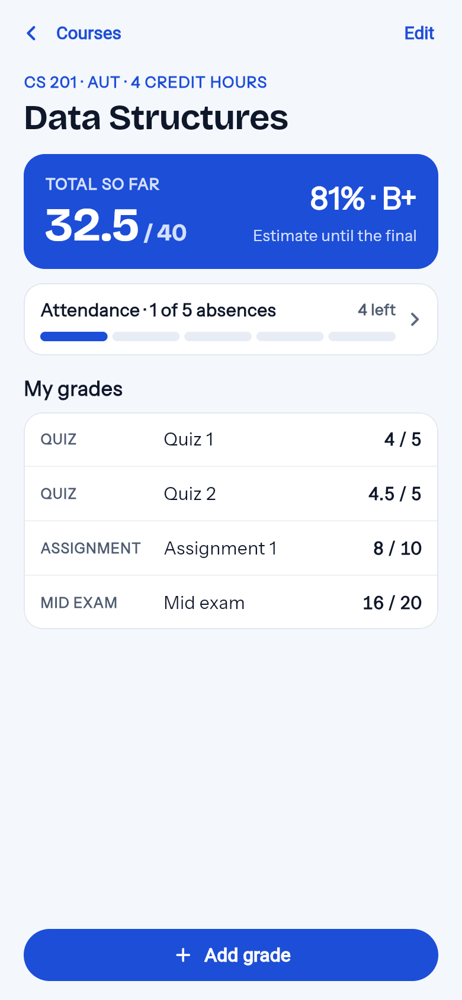
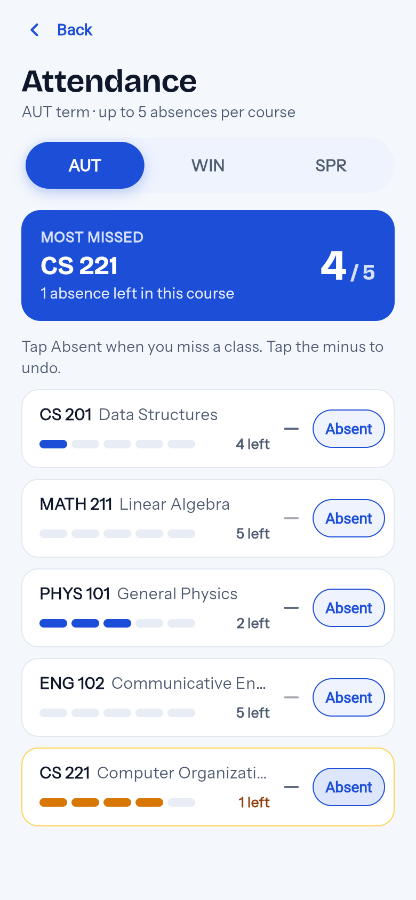
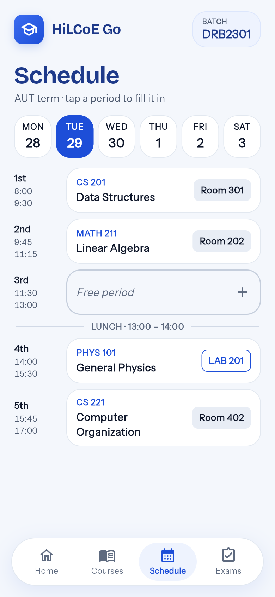
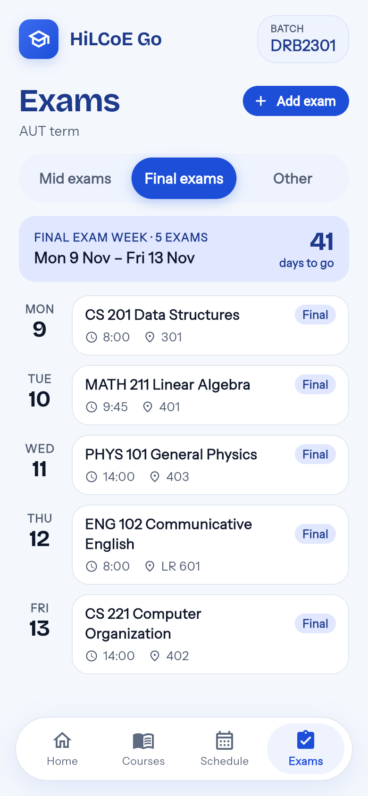

<p align="center">
  
</p>

<h1 align="center">HiLCoE Go</h1>

<p align="center">
  Your whole term in one place: courses, grades, attendance, exams and your
  class schedule, built for students at HiLCoE.
</p>

<p align="center">
  
  
  
</p>

---

## Download

Grab the latest version from **[Releases](https://github.com/nebiyoudawit/HiLCoE-Go/releases/latest)**.

**Android**
1. Download `HiLCoE-Go-v1.0.0.apk` on your phone and open it.
2. If Android asks, allow your browser or file manager to **install unknown apps**.
3. Open HiLCoE Go, sign up, and verify your email.

**iPhone** (sideloaded, no App Store yet)
1. Download `HiLCoE-Go-v1.0.0.ipa` to your computer.
2. Install it with a sideloading tool such as [Sideloadly](https://sideloadly.io) or [AltStore](https://altstore.io), signed with your own Apple ID.
3. On the iPhone, go to **Settings → General → VPN & Device Management** and trust your Apple ID. On iOS 16 and later, also turn on **Settings → Privacy & Security → Developer Mode**.
4. With a free Apple ID the app has to be re-installed every 7 days. Your data is saved in the cloud, so nothing is lost.

## Screenshots

<table>
  <tr>
    <td align="center"><br><sub>Log in</sub></td>
    <td align="center"><br><sub>Home</sub></td>
    <td align="center"><br><sub>Courses</sub></td>
  </tr>
  <tr>
    <td align="center"><br><sub>Grades</sub></td>
    <td align="center"><br><sub>Attendance</sub></td>
    <td align="center"><br><sub>Schedule</sub></td>
  </tr>
  <tr>
    <td align="center"><br><sub>Exams</sub></td>
    <td></td>
    <td></td>
  </tr>
</table>

<sub>Screenshots show a sample student with sample data.</sub>

---

## Features

- **Accounts:** sign up with your name, email, batch (e.g. `DRB2301`) and optional student ID. Email verification, forgot password, edit profile, change password and delete account are all built in.
- **Courses by year and term:** AUT, WIN and SPR for each academic year. Add past years' courses too, and a fresh year starts every September.
- **Grades:** enter quizzes, assignments, projects, mid and final exams one by one (e.g. `16 / 20`) and watch the running total.
- **Letter grades and GPA:** the HiLCoE scale (A+ 90, A 85, B+ 75, B 65, C+ 60, C 50, D 40, F below), with credit-weighted term GPA and overall CGPA.
- **Attendance:** tap *Absent* when you miss a class. Each course allows 5 absences per term, with amber and red warnings as you get close.
- **Exams:** mid, final and other exams with date, start time and room, grouped by exam week, plus a countdown on Home.
- **Class schedule:** Monday to Friday plus a Saturday half day, using HiLCoE's periods (8:00, 9:45, 11:30, lunch, 14:00, 15:45).
- **Home at a glance:** the class happening now or next, today's classes, your next exam, the course you've missed most, and your GPA.
- **Sync everywhere:** your data lives in the cloud and syncs live between your phone and other devices. It keeps working offline.

## Tech stack

| Part | What we used |
|---|---|
| App | [Flutter](https://flutter.dev) (Dart), Material 3 |
| State | [provider](https://pub.dev/packages/provider) (`ChangeNotifier`) |
| Accounts | [Firebase Authentication](https://firebase.google.com/docs/auth) (email and password) |
| Database | [Cloud Firestore](https://firebase.google.com/docs/firestore), with offline cache and live updates |
| Fonts | Bricolage Grotesque and Instrument Sans, bundled in the app |

### How data is stored

```
users/{uid}                    profile: name, email, batch, studentId
users/{uid}/data/courses       { items: [...] }  courses with grades and absences
users/{uid}/data/exams         { items: [...] }
users/{uid}/data/schedule      { items: [...] }
```

[`firestore.rules`](firestore.rules) lets each student read and write only their own documents, and requires a verified email for course data.

### Project layout

```
lib/
  main.dart               starts Firebase and the app state
  app.dart                picks the screen: loading, log in, verify email or home
  data/                   Firebase Auth + Firestore access (repositories)
  models/                 Course, Grade, Exam, ClassSlot, Term, grading scale
  state/                  AuthState and CourseState (what the screens read)
  screens/                auth, home, courses, schedule, exams, attendance, profile
  widgets/                shared pieces: header, pills, chips, pickers
  theme/                  colors and text styles
test/                     unit tests
```

## Run it yourself

You need [Flutter](https://docs.flutter.dev/get-started/install) and, for your own backend, a Firebase project.

```bash
git clone https://github.com/nebiyoudawit/HiLCoE-Go.git
cd HiLCoE-Go
flutter pub get
flutter run
```

To use **your own** Firebase project instead of ours:

1. Create a project at [console.firebase.google.com](https://console.firebase.google.com). Enable **Authentication → Email/Password** and create a **Firestore Database**.
2. Install the tools: `npm install -g firebase-tools` and `dart pub global activate flutterfire_cli`.
3. Run `firebase login`, then `flutterfire configure` (this regenerates `lib/firebase_options.dart`).
4. Deploy the security rules: `firebase deploy --only firestore:rules`.

### Build

- **Android APK:** `flutter build apk --release`, output in `build/app/outputs/flutter-apk/`.
- **iPhone (no Mac needed):** run the **Build iOS IPA (unsigned)** workflow from the *Actions* tab. It builds on a GitHub macOS runner, and you download the `.ipa` from the run's *Artifacts* and install it with a sideloading tool.
- **Tests:** `flutter test`.

## Roadmap

- [ ] Exam reminders the evening before
- [ ] Import the class schedule from the university's PDF

---

<p align="center">Made by <a href="https://github.com/nebiyoudawit">@nebiyoudawit</a> for HiLCoE students.</p>
